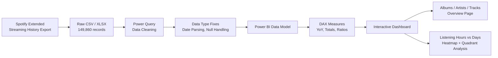

<div align="center">


# 🎧 Spotify Listening Behaviour Analysis
### Turning 11 Years of Personal Streaming History into Actionable Listening Insights


</div>

---

## 📌 Project Overview

This project analyzes **149,860 personal Spotify streaming events**, spanning **February 2013 to December 2024**, to uncover how listening habits evolve over more than a decade. The dataset is Spotify's own **Extended Streaming History export** — the raw event-level log Spotify generates for every track played, skipped, or shuffled.

Rather than working with a generic public "top tracks" dataset, this project treats the data the way a music-streaming company would: as **behavioral event data** — capturing not just *what* was played, but *when*, *on which device*, *whether it was skipped*, and *whether shuffle was active*. That distinction matters, because it's the difference between a "what's popular" report and a genuine **user engagement and retention analysis** — the kind of question a real Spotify Data Analyst would be asked to answer.

**Why this matters for a business:** streaming platforms like Spotify make product and monetization decisions based on exactly this kind of behavioral signal — skip rate drives recommendation algorithm tuning, platform-of-use drives UX investment decisions, and peak listening hours drive content/ad placement strategy.

---

## 🎯 Project Objectives

- Quantify listening volume and engagement trends across **11+ years** of history
- Identify **peak listening hours and days** to understand usage rhythm
- Measure **skip behavior and shuffle usage** as engagement proxies
- Surface **top artists, albums, and tracks** by actual play frequency (not just saves/likes)
- Compare **year-over-year (YoY)** listening volume to detect growth or decline in engagement
- Break down listening activity **by platform** (mobile, desktop, web, smart speaker)
- Package all of the above into an **interactive, filterable Power BI dashboard**

---

## 🗂️ Dataset Information

| Detail | Value |
|---|---|
| **Source** | Spotify Extended Streaming History (personal data export via Spotify's official data request tool) |
| **File** | `spotify_history_1.csv` (raw), also provided as `spotify_history.xlsx` |
| **Records** | 149,860 streaming events |
| **Columns** | 11 |
| **Date Range** | Feb 8, 2013 – Dec 15, 2024 |
| **Unique Tracks** | 13,839 |
| **Unique Artists** | 4,113 |
| **Unique Albums** | 7,946 |
| **Missing Values** | `reason_start` (143 nulls), `reason_end` (117 nulls) — negligible, <0.1% of records |

### Column Reference

| Column | Type | Description |
|---|---|---|
| `spotify_track_uri` | Text | Unique Spotify track identifier (`spotify:track:<id>`) |
| `ts` | Datetime | UTC timestamp when the track stopped playing |
| `platform` | Categorical | Device used — android, iOS, mac, windows, web player, cast to device |
| `ms_played` | Numeric | Milliseconds the track played before stopping |
| `track_name` | Text | Song title |
| `artist_name` | Text | Performing artist |
| `album_name` | Text | Album the track belongs to |
| `reason_start` | Categorical | Why playback started (autoplay, clickrow, fwdbtn, etc.) |
| `reason_end` | Categorical | Why playback ended (trackdone, endplay, fwdbtn, etc.) |
| `shuffle` | Boolean | Whether shuffle mode was active |
| `skipped` | Boolean | Whether the track was skipped before finishing |

---

## 🛠️ Technologies Used

| Technology | Purpose |
|---|---|
| **Power BI Desktop** | Core BI tool — data modeling, DAX measures, interactive dashboard build |
| **DAX** | Time-intelligence calculations (year-over-year comparisons, rolling totals) and custom KPI measures |
| **Power Query** | Data cleaning and shaping (date parsing, boolean standardization, null handling) before loading into the model |
| **Microsoft Excel** | Secondary raw-data format (`spotify_history.xlsx`) for portability/inspection |

> **Note on transparency:** this project's analysis layer is entirely Power BI/DAX — there is no Python or SQL component in the current version. Python and SQL extensions are listed under [Future Improvements](#-future-improvements) as genuine next steps, not implemented features.

---

## 🔄 Project Workflow



---

## 📊 Exploratory & Behavioral Analysis

Analysis was performed directly on the cleaned dataset within Power BI, structured around four core behavioral questions:

**1. Volume over time (2013–2024)**
Listening volume was tracked year-over-year across albums, artists, and tracks played. Activity was minimal from 2013–2015, then grew sharply from 2016 onward, peaking around 2017 and again in 2020, before gradually declining through 2023–2024 — visible directly in the dashboard's time-series sparklines.

**2. Peak listening hours vs. days of week**
A hour-by-day heatmap (0–23h × Mon–Sun) reveals when listening activity concentrates — a proxy for daily routine (e.g., commute hours, evening wind-down) rather than random usage.

**3. Skip and shuffle behavior**
Skip rate sits at **~5.25%** of all plays, and shuffle mode is active in **~74.5%** of sessions — indicating a strong preference for shuffled, low-intentional-skip listening rather than actively curated, skip-heavy sessions.

**4. Track engagement depth (quadrant analysis)**
A scatter plot of **average listening time vs. track play frequency** segments tracks into engagement quadrants — high-frequency/high-duration tracks (genuine favorites) vs. high-frequency/low-duration tracks (background or skip-prone listening).

---

## ❓ Key Business Questions Answered

| # | Business Question |
|---|---|
| 1 | How has listening volume changed year-over-year? |
| 2 | What platform is used most for streaming? |
| 3 | What are the top 5 most-played artists, albums, and tracks? |
| 4 | What time of day and day of week sees peak listening activity? |
| 5 | What percentage of tracks are skipped before completion? |
| 6 | How prevalent is shuffle-mode listening vs. deliberate track selection? |
| 7 | How does this year's listening volume compare to the previous year? |
| 8 | Which tracks have the highest combination of frequency and engagement duration? |
| 9 | Is listening activity concentrated on weekdays or weekends? |
| 10 | Which artists/albums dominate long-term listening habits across a decade? |

---

## 💡 Key Insights

1. **Android is the overwhelmingly dominant platform** — 139,821 of 149,860 plays (~93%) happened on Android, dwarfing all other platforms combined.
2. Listening activity spans **13,839 unique tracks** across **4,113 artists** and **7,946 albums**, indicating broad, varied listening rather than a narrow rotation.
3. **The Beatles are the most-played artist by a wide margin** — 13,621 plays, more than double the next artist (The Killers, 6,878 plays).
4. Top albums are similarly Beatles-dominated: *The Beatles* (White Album), *Past Masters*, *Abbey Road*, *The Wall*, and *Revolver* make up the top 5.
5. **Shuffle mode is active in ~74.5% of all plays**, suggesting a strong preference for passive/randomized listening over manually curated sessions.
6. **Skip rate is low, at ~5.25%** — the large majority of tracks are played through, suggesting generally high satisfaction with what's queued.
7. **Average listening duration per track is ~2.14 minutes**, noticeably shorter than typical full-song length (~3–4 min), consistent with the 5% skip rate plus natural short-track/interlude plays.
8. Listening volume **peaked around 2017 and 2020**, both years showing markedly higher activity than adjacent years — potential markers of major life-context shifts (e.g., routine changes, availability of more free time).
9. Volume has **trended downward since 2020**, from a 2020 peak of 24,280 events to 9,870 in 2024 — a meaningful decline worth investigating further (e.g., shifting to other platforms, life changes, or reduced music consumption generally).
10. **2013–2015 show minimal activity** (185 and 23 events respectively before ramping up), suggesting this account's *habitual* usage effectively began around 2016.
11. The **"cast to device" platform** (smart speakers/TVs) accounts for a small but notable share (3,898 plays) — a secondary listening context beyond mobile.
12. **Web player usage is minimal** (225 plays total) — nearly all listening happens through native apps, not the browser.
13. The top single track, *"Ode To The Mets"*, was played 207 times — showing certain individual tracks develop strong repeat-listen loyalty distinct from overall artist/album ranking.
14. **Missing `reason_start`/`reason_end` values are negligible** (<0.1% combined), indicating the exported dataset is largely complete and reliable for analysis.
15. The gap between **93% Android usage and near-zero web player usage** signals a strongly mobile-first, single-ecosystem listening pattern.

---

## 📈 Business Recommendations

If this were user-behavior data feeding into Spotify's own product decisions, it would support:

- **User Engagement** — A ~74.5% shuffle rate combined with low skip rate suggests the "Discovery via Shuffle" experience is working well for this listening profile; similar users could be prioritized for shuffle-based recommendation surfaces rather than manually-curated playlist pushes.
- **Music Recommendations** — Heavy concentration on a narrow set of artists (Beatles-led) despite 4,113 unique artists played suggests recommendation algorithms should balance "more of the same" with controlled discovery nudges to prevent catalog staleness.
- **Playlist Quality** — Low skip rate (~5.25%) indicates existing queue/playlist curation aligns well with actual preference — a positive signal worth replicating for similar user cohorts.
- **Artist Promotion** — Legacy catalog artists (Beatles, Dylan, McCartney) dominate top plays; platforms could use this pattern to identify users receptive to "classic rock era" artist promotions and reissues.
- **Revenue** — Since Spotify pays artists based on `ms_played`, tracking average play duration per artist/album (as done here) is directly relevant to royalty and payout analytics.
- **User Retention** — The declining trend from 2020 (24,280 events) to 2024 (9,870 events) is a retention red flag pattern; in a real product context, this kind of usage decay would trigger a re-engagement campaign trigger.

---

## 🖼️ Dashboard Preview

> ⚠️ **To display these images on GitHub:** add your exported dashboard screenshots to a `/screenshots` folder in this repo, then update the paths below to match (e.g., `screenshots/overview.png`).

**Page 1 — Albums / Artists / Tracks Overview**
Shows total albums (7,905), artists (4,112), and tracks (13,665) played over time, each with a year-over-year sparkline, weekday/weekend split donut charts, and Top 5 rankings by play count.

```

```

**Page 2 — Listening Hours vs Days + Track Engagement Quadrant**
An hour-by-day heatmap showing exactly when listening activity concentrates, paired with a scatter plot mapping track play frequency against average listening time — with adjustable threshold sliders to isolate high-engagement tracks (highlighted in green).

```

```

---

## 📁 Folder Structure

```
Spotify_Data_analysis/
│
├── README.md                          # Project documentation
├── Spotify_Logo_Final.png             # Branding asset used in dashboard
├── Spotify Data Explaination.docx     # Column-by-column data dictionary
├── spotify_analysis_report.pbix       # Power BI report (dashboard + data model + DAX)
├── spotify_history_1.csv              # Raw dataset (CSV)
├── spotify_history.xlsx               # Raw dataset (Excel)
└── Spotify Data.rar                   # Compressed archive of source data
```

---

## ⚙️ Installation & How to Run Locally

1. **Clone the repository**
   ```bash
   git clone https://github.com/Manichandu2210/Spotify_Data_analysis.git
   ```
2. **Install Power BI Desktop** (free) — [Download here](https://powerbi.microsoft.com/desktop/)
3. Open `spotify_analysis_report.pbix` directly in Power BI Desktop — the data model and all DAX measures are embedded in the file.
4. To explore the raw data independently, open `spotify_history_1.csv` or `spotify_history.xlsx` in Excel, or load it into Power Query for inspection.

---

## 📚 Libraries / Tools Used

| Tool | Why |
|---|---|
| **Power BI Desktop** | Free, industry-standard BI tool for building interactive dashboards from tabular data |
| **DAX** | Enables time-intelligence calculations (YoY comparisons) and custom aggregate measures beyond what raw columns provide |
| **Power Query (M)** | Handles data cleaning/shaping — date parsing, type conversion, deduplication — before the model layer |

---

## 🧠 Skills Demonstrated

- Power BI dashboard design and interactivity (slicers, drill-through-ready structure)
- DAX measure authoring, including time-intelligence patterns
- Data cleaning and type standardization via Power Query
- Behavioral/event-data analysis (as opposed to simple aggregate reporting)
- KPI definition and business-relevant metric selection (skip rate, shuffle rate, engagement duration)
- Data storytelling — translating raw event logs into a business-legible narrative
- Version control and project documentation via GitHub

---

## 🧩 Challenges Faced

- **Inconsistent timestamp formats** in the raw export required careful parsing in Power Query to avoid silently dropping or misreading dates across the 11-year span.
- **Boolean fields stored as text** (`TRUE`/`FALSE` strings for `shuffle` and `skipped`) needed explicit type conversion before they could be used in DAX logic and visuals.
- **Long-tail track/artist distribution** (13,839 unique tracks vs. a handful of dominant artists) made Top-N visuals prone to being skewed by one or two heavy-rotation artists — addressed by presenting both aggregate and per-track engagement views side by side.

---

## 🚀 Future Improvements

- [ ] Add a **Python/pandas EDA notebook** as a companion analysis layer with statistical testing (currently Power BI-only)
- [ ] Load the dataset into **MySQL/PostgreSQL** and rebuild key metrics as SQL queries for a dual BI + SQL portfolio piece
- [ ] Build a **skip-prediction model** (classification) to predict likelihood of skip based on artist, time of day, and platform
- [ ] Integrate the **live Spotify Web API** to enable rolling/real-time dashboard updates instead of static export-based analysis
- [ ] Deploy an interactive version via **Streamlit** or **Power BI Service** publish for shareable, no-download access
- [ ] Add **genre-level analysis** by enriching track data via the Spotify API (genre isn't present in the raw export)

---

## 🌟 Why This Project Stands Out

This isn't a rerun of a public Kaggle "top Spotify tracks" dataset — it's an **11-year, 150K-row personal behavioral log**, analyzed the way a streaming company's analytics team would: through engagement signals (skip rate, shuffle rate, session duration) rather than surface-level popularity counts. It demonstrates the ability to take a **raw, real-world, imperfect event log** — not a pre-cleaned textbook dataset — and turn it into a decision-ready dashboard with genuine longitudinal (multi-year) trend analysis, which is meaningfully harder than single-snapshot reporting.

---

## 📝 Resume Points

- Analyzed **149,860 personal Spotify streaming events spanning 11+ years (2013–2024)** to uncover listening behavior trends using Power BI and DAX.
- Built an interactive Power BI dashboard tracking **13,839 unique tracks, 4,113 artists, and 7,946 albums**, with year-over-year comparison visuals.
- Designed a **skip-rate and shuffle-rate engagement analysis** (5.25% skip rate, 74.5% shuffle rate) to quantify passive vs. active listening behavior.
- Created an **hour-by-day listening heatmap** to identify peak usage windows across a full week cycle.
- Built a **quadrant scatter analysis** comparing track play frequency against average listening duration to isolate high-engagement tracks.
- Performed data cleaning in Power Query on inconsistent timestamp formats and text-encoded boolean fields across a 150K-row dataset.
- Authored DAX time-intelligence measures for year-over-year (YoY) volume comparisons across albums, artists, and tracks.
- Delivered a fully self-directed, end-to-end BI project — from raw Spotify data export to a polished, filterable dashboard.

---

## 🎤 Interview Questions & Answers (Based on This Project)

**1. Q: Where did this dataset come from?**
A: Spotify's own Extended Streaming History export — an official personal data request from Spotify, not a third-party/Kaggle dataset.

**2. Q: How many records and what's the time span?**
A: 149,860 events from February 2013 to December 2024 — roughly 11 years of listening history.

**3. Q: What does `ms_played` represent, and why does it matter?**
A: Milliseconds a track played before stopping. It's the basis for engagement analysis and mirrors how Spotify itself calculates artist royalties.

**4. Q: How did you calculate skip rate, and what did you find?**
A: Skip rate = proportion of `skipped = TRUE` records over total plays. Found ~5.25%, indicating most tracks are played through rather than abandoned.

**5. Q: What tool did you build the dashboard in, and why?**
A: Power BI Desktop — chosen for its strong DAX time-intelligence support and ability to build interactive, filterable dashboards without needing a hosted backend.

**6. Q: What's a DAX time-intelligence measure, and where did you use one?**
A: A DAX pattern that compares a metric across time periods (e.g., this year vs. last year) using functions like `SAMEPERIODLASTYEAR` or `DATEADD`. Used here for the "Latest Year vs Previous Year" comparisons on the overview page.

**7. Q: Why is shuffle rate a meaningful metric, not just a fun fact?**
A: It signals listening intent — high shuffle usage suggests passive/discovery-style listening, which has different product implications (e.g., recommendation weighting) than deliberate, ordered playback.

**8. Q: How did you handle the boolean columns stored as text?**
A: Converted `TRUE`/`FALSE` string values to proper boolean type in Power Query so they could be used correctly in DAX logic and filters.

**9. Q: What would you do differently with more time?**
A: Add a genre dimension via the Spotify API (not present in the raw export) and build a Python-based statistical layer alongside the Power BI dashboard.

**10. Q: Why did listening volume decline after 2020?**
A: The dataset alone can't answer that causally — it shows the pattern (24,280 events in 2020 down to 9,870 in 2024) but not the cause. In an interview, I'd flag this as a place I'd want qualitative context or additional data (e.g., app switch, life changes) rather than speculate.

**11. Q: What's the difference between `reason_start` and `reason_end`?**
A: `reason_start` captures why a track began playing (autoplay, manual click, etc.); `reason_end` captures why it stopped (finished naturally, skipped, session ended). Together they describe the full lifecycle of a single play event.

**12. Q: How would you validate this dashboard's numbers are correct?**
A: Cross-check aggregate counts (e.g., total plays, unique track/artist counts) between the Power BI visuals and a direct query/count on the raw CSV — which is exactly how I confirmed the numbers in this README.

**13. Q: What's a limitation of using play *count* alone to rank artists?**
A: It doesn't account for track length or engagement depth — an artist with many short tracks could rank higher than one with fewer, longer, more deeply-engaged-with tracks. That's why the quadrant analysis (frequency vs. average duration) was added as a complementary view.

**14. Q: Why 74.5% shuffle rate — is that high or low?**
A: Relatively high — it suggests this listener leans toward passive, randomized consumption of a broad library rather than replaying a small, manually ordered set of favorites.

**15. Q: What would you change about the dataset before trusting it fully?**
A: I'd flag the 143 missing `reason_start` and 117 missing `reason_end` values (though negligible at <0.1%) and confirm timestamp values are consistently in UTC before doing any hour-of-day analysis, since timezone drift would quietly corrupt the peak-hours heatmap.

**16. Q: Why is Android 93% of plays — is that expected?**
A: It reflects this specific user's device ecosystem, not a general Spotify trend — an important distinction between describing *this* dataset accurately versus over-generalizing to "most people use Android."

**17. Q: What's the business value of the hour/day heatmap?**
A: It reveals routine-driven usage patterns (e.g., commute or evening listening), which is directly useful for timing push notifications, ad placement, or new-release promotion windows.

**18. Q: If asked to scale this to millions of users, what would change?**
A: Power BI/DAX on a flat CSV wouldn't scale — I'd move ingestion to a proper pipeline (e.g., Spark/Databricks for processing at scale) with a warehouse layer feeding Power BI, rather than loading raw files directly.

**19. Q: What's one insight you're confident in, and one you're not?**
A: Confident: the skip rate and shuffle rate, since those are direct column calculations. Less confident: attributing the 2017/2020 volume peaks to any specific cause — the data shows *what* happened but not *why*.

**20. Q: Why didn't you use Python for this project?**
A: I built it in Power BI first to deliver a complete, polished BI artifact end-to-end. Extending it with a Python/pandas layer is a planned next step, listed explicitly in Future Improvements, not something I'm claiming is already done.

---

## ✅ Conclusion

This project demonstrates the ability to take a raw, unglamorous, real-world data export — not a pre-cleaned tutorial dataset — and turn it into a genuinely useful behavioral analysis: quantifying engagement (skip/shuffle rates), timing patterns (hour/day heatmaps), and long-term trends (11-year YoY volume) that mirror the kind of questions a real streaming platform's analytics team would investigate. It reflects practical Power BI and DAX proficiency, careful data cleaning judgment, and — just as importantly — honesty about what the dataset can and cannot tell you.

</div>
